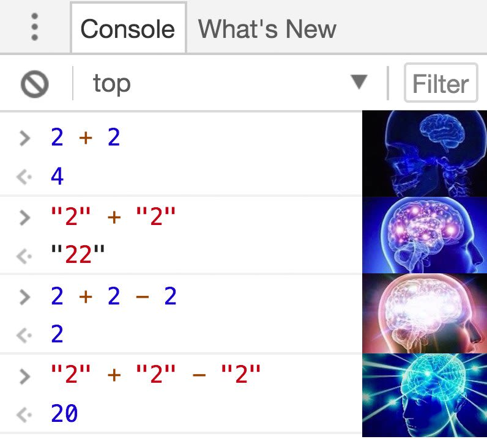
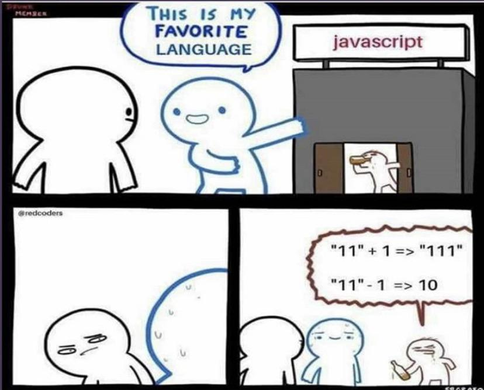
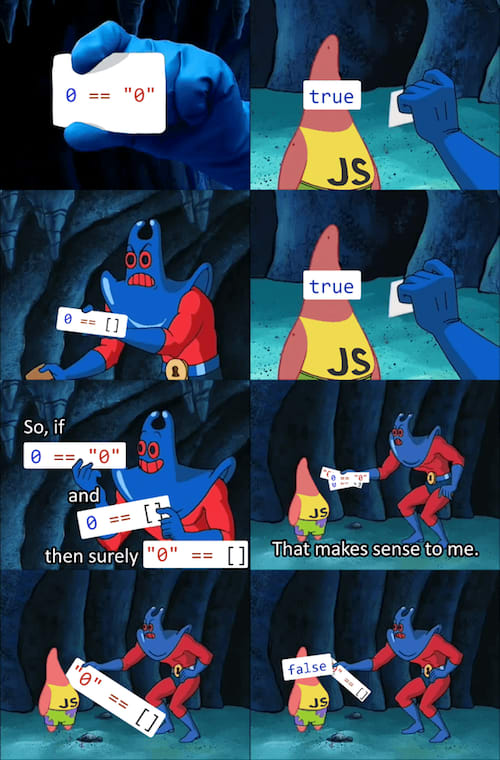

# 1. 자바스크립트 입문

## JavaScript란
웹 브라우저에서 사용하기 위해 만들어진 언어.
기본적으로 브라우저 console에서 사용할 수 있으며 Node.js 런타임, React-Native 등이 개발되어 다양한 진영에서 사용되고 있다.

<details>
<summary><s>JavaScript의 위대함을 보여주는 밈</s></summary>





</details>

## JavaScript 기본 문법
### 변수와 상수
```javascript
let value = 1;  // 변수
const a = 1;    // 상수 

var b = 1;      // legacy, 권장 X!!
```

### 데이터 타입
* `Number`
* `String`
* `Boolean`
* `nul`l v.s. `undefined`
    ```javascript
    const notnull = null;   // null
    const something;        // undefined
    ```

### 연산자
비교 연산자
* `==` 는 타입 검사까지 하지 않음 (**권장 X**)
* `===` 는 타입 검사도 실시

### 함수
```javascript
// basic
function add(a, b) {
    return a + b;
}
// declarative
const add = (a, b) => a + b;
```
<br>

### **객체**
```javascript
const dog = {
  name: '멍멍이',
  sound: '멍멍!',
  say: function say() {
    console.log(this.sound);
  }
};
```
함수에서 객체를 받기
```javascript
// 기본
function print(pet) {
  const text = `${pet.name}이 내는 소리 ${pet.sound}`;
  console.log(text);
}
// 비구조화 할당
function print(pet) {
  const { name, sound } = pet;
  const text = `${pet.name}이 내는 소리 ${pet.sound}`;
  console.log(text);
}
// 파라미터 단계에서의 비구조화 할당
function print({ name, sound }) {
  const text = `${pet.name}이 내는 소리 ${pet.sound}`;
  console.log(text);
}
```
<br>

### **배열**
```javascript
const array = [1,2,3,4,5]
const objects = [{ name: '멍멍이' }, { name: '야옹이' }];
```
기본 메소드
```javascript
objects.push({ name: '멍뭉이' })
objects.length  // 3
```
**유용한 메소드!**
- mapping
  ```javascript
  // forEach
  objects.forEach(pet => {
    console.log(pet);
  })

  // map: function을 배열에 element-wise 적용
  const square = n => n * n;
  const squared = array.map(square);
  // 이렇게도 쓸 수 있다.
  // const squared = array.map(n => n * n);

  // filter: 조건식을 만족하는 값만 추출해 새로운 배열 만듬
  const meow = objects.filter(pet => pet.name === '야옹이');  // [ { name: '야옹이' } ]

  // reduce
  let sum = array.reduce((accumulator, current) =>
    accumulator + current, 0
  );
  ```

- 삽입/삭제
  ```javascript
  // splice: 배열에서 특정 항목 제거 (arg: start, deleteCount)
  // slice: splice와 유사, but 기존 배열은 유지하고 새 배열 리턴
  array.splice(2, 1);  // [1,2,4,5]
  const sliced = array.slice(2, 1);  // [1,2,4,5]

  // shift 와 pop
  const value = array.shift();  // 1
  const value = array.pop();  // 5
  array.unshift(0);  // [0,1,2,3,4,5]
  array.unshift(6);  // [1,2,3,4,5,6]
  ```

- 배열 조작
  ```javascript
  const arr1 = [1, 2, 3];
  const arr2 = [4, 5, 6];
  const concated = arr1.concat(arr2);  // [1,2,3,4,5,6]

  const array = [1, 2, 3, 4, 5];
  console.log(array.join()); // 1,2,3,4,5
  console.log(array.join(' ')); // 1 2 3 4 5
  console.log(array.join(', ')); // 1, 2, 3, 4, 5
  ```

- 검색
  ```javascript
  // 배열 내 검색
  const index = array.indexOf(3);  // 2
  const index = objects.findIndex(pet => pet.name === '야옹이');  // 1
  const pet = objects.find(pet => pet.name === '야옹이');  // { name: '야옹이' }
  ```
<br>

### **반복문**
```javascript
const names = ['멍멍이', '야옹이', '멍뭉이'];

// for-loop
for (let i = 0; i < names.length; i++) { ... }
for (let name of names) { ... }
// while-loop
let i = 0;
while (i < names.length) { ... }
```
객체를 위한 반복문
```javascript
const doggy = {
  name: '멍멍이',
  sound: '멍멍',
  age: 2
};

console.log(Object.entries(doggy));   // [[name, '멍멍이'], [sound, '멍멍'], [age, 2]]
console.log(Object.keys(doggy));      // [name, sound, age]
console.log(Object.values(doggy));    // ['멍멍이', '멍멍', 2]

for (let key in doggy) {
  console.log(`${key}: ${doggy[key]}`);
}
```

## 프로토타입과 클래스
### 프로토타입
`.prototype.[원하는 key] = ` 로 설정
```javascript
function Animal(type, name, sound) {
  this.type = type;
  this.name = name;
  this.sound = sound;
}
Animal.prototype.say = function () {
  console.log(this.sound);
};
Animal.prototype.sharedValue = 1;

const dog = new Animal('개', '멍멍이', '멍멍');
const cat = new Animal('고양이', '야옹이', '야옹');

dog.say();  // '멍멍'
cat.say();  // '야옹'

console.log(dog.sharedValue);  // 1
console.log(cat.sharedValue);  // 1
```
객체 생성자 상속받기
```javascript
...
Animal.prototype.sharedValue = 1;

function Dog(name, sound) {
  Animal.call(this, '개', name, sound);
}
Dog.prototype = Animal.prototype;

const dog = new Dog('멍멍이', '멍멍');
dog.say();  // '멍멍'

```

### 클래스와 상속
```javascript
class Animal {
  constructor(type, name, sound) {
    this.type = type;
    this.name = name;
    this.sound = sound;
  }
  say() {
    console.log(this.sound);
  }
}

class Dog extends Animal {
  constructor(name, sound) {
    super('개', name, sound);
  }
}

const dog = new Dog('멍멍이', '멍멍');
dog.say();  // '멍멍'
```
